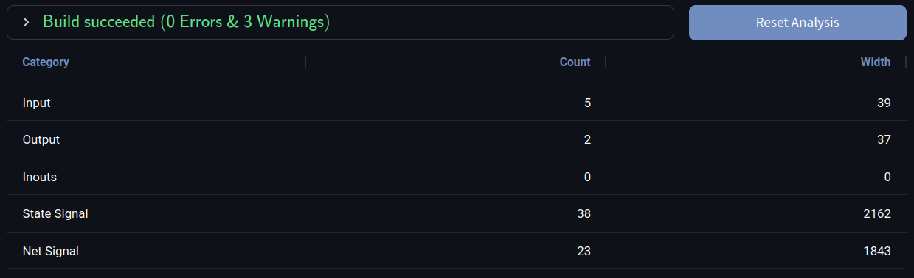
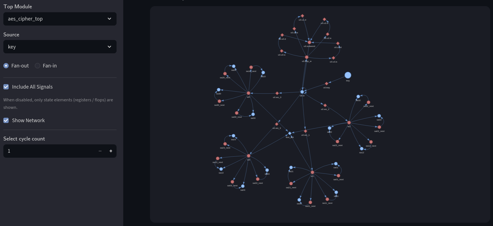
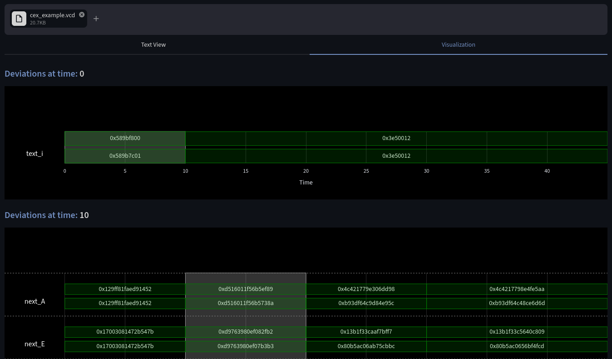

# UPEC Tool

[❰Getting Started❱](#getting-started) ∣ [❰Functionality❱](#functionality) | [❰References❱](#references)

A high-performance security analysis tool for hardware designs written **Verilog** and **SystemVerilog**.
The UPEC tool is designed to automate the process of creating end-to-end security proofs based on formal verification.
It automatically breaks down the overall proof problem into a set of formal SystemVerilog Assertions (SVA) properties, which can then be proven using standard model checkers.
This logical decomposition is based on **Unique Program Execution Checking (UPEC)**[^1][^2].
A structural analysis is implemented that extracts potential information flows and reduces the search space for formal methods[^3].

*This tool is still a work in progress. Please let us know if you encounter any issues.*

# Getting Started
We use [Streamlit](https://github.com/streamlit/streamlit) as our app framework and build our analysis on [slang](https://github.com/MikePopoloski/slang)'s syntax parser.

1. Install all the Python dependencies listed in the requirements.txt file.
2. Start the app with `streamlit run main.py`.
3. Open http://localhost:8501 in your browser.
4. Upload the (System)Verilog files and confirm your selection to begin the analysis.
5. Select the desired functionality from the tabs.

# Functionality

### 🏠 Design Overview

This tab offers a high-level overview of the analysed design.
It includes the number of identified signals and ports, as well as their cumulative bit width.
More detailed information can be presented by configuring the overview in the sidebar, if needed.
In addition, any errors or warnings that occurred while parsing the SystemVerilog files are displayed.

### 🌿 Fan Analysis

The Fan Analysis provides insights into the structural fan-in and fan-out of the selected signal.
Any structural connection represents a *potential* information flow to be evaluated by the formal security analysis.
Therefore, the structural information significantly reduces the computational effort for the formal methods.
The fan information can be displayed as text or as a graphical representation, as shown in the screenshot above.

### 📍 Shortest Path Finder

This tab can be used to compute the shortest possible path between a given source and target signal, which can be useful for identifying the root cause of security vulnerabilities.

### 🛡️ UPEC-DIT

**Unique Program Execution Checking for Data-Independent Timing (UPEC-DIT)**[^2] is a method for verifying the absence of data-dependent timing channels in hardware designs. 
It verifies that the data being processed does not affect the control behavior of the system. 
The UPEC Tool automates this methodology to a great extent.
After providing high-level interface information, the tool generates the computational model, formal properties and setup scripts.
The user simply runs the script from the model checker, which returns either a proof or a counterexample.

### 🪲 Trojan Detection

This tab implements a formal verification method that identifies stealthy hardware trojans without requiring a golden (trusted) reference design or specification.
The analysis focuses on non-interfering accelerator designs, which require that the result of a computation must not depend on previous operations.
The verification method detects malicious logic by analyzing how information propagates through the design over time.
For more information, please refer to our paper[^4].

The UPEC tool completely automates the steps of the trojan detection method by generating the computational model, formal properties and setup scripts.

### 🔍 Counterexample Visualization

UPEC models information flows by monitoring the difference between two instances of the design under verification.
Consequently, any counterexamples presented by the model checker contain every signal twice.
In most cases, the verification engineer is not interested in the specific signal values, only the difference between the two instances.
Therefore, the UPEC tool offers a feature that provides counterexample analysis and visualization.

Users can upload a UPEC-style trace in .vcd format. 
The tool automatically identifies the two instances of the design and extracts all signal differences.
The first signal value deviation is presented as text or a waveform representation.
In the current version of the tool, the Counterexample Visualization is independent of the uploaded design.

### 💾 Download

The Download section allows for the separate export of the 

- **fan-in** and **fan-out** of all design signals in JSON format.
- **2-instance computational model** used for all UPEC approaches in SystemVerilog.
- **State Equivalence** macro in SVA, which is another common component of UPEC.

# References

[^1]: M.R. Fadiheh, A. Wezel, J. Mueller, J. Bormann, S. Ray, J. Fung, S. Mitra, D. Stoffel, W. Kunz: 
[An Exhaustive Approach to Detecting Transient Execution Side Channels in RTL Designs of Processors](https://ieeexplore.ieee.org/abstract/document/9716812). 
In IEEE Transactions on Computers, vol. 72, no. 1, pp. 222-235, Jan. 2023.
[^2]: L. Deutschmann, J. Müller, M.R. Fadiheh, D. Stoffel, W. Kunz: 
[A Scalable Formal Verification Methodology for Data-Oblivious Hardware](https://ieeexplore.ieee.org/abstract/document/10462490).
In IEEE Transactions on Computer-Aided Design of Integrated Circuits and Systems, vol. 43, no. 9, pp. 2551-2564, Sept. 2024.
[^3]: L. Deutschmann, A. Meza, D. Stoffel, W. Kunz, R. Kastner: 
[FastPath: A Hybrid Approach for Efficient Hardware Security Verification](https://ieeexplore.ieee.org/abstract/document/11132905). 
In Proceedings of the 62nd ACM/IEEE Design Automation Conference (DAC), San Francisco, CA, USA, 2025.
[^4]: A. L. Duque Antón, J. Müller, L. Deutschmann, M. R. Fadiheh, D. Stoffel, W. Kunz:
[A Golden-Free Formal Method for Trojan Detection in Non-Interfering Accelerators](https://ieeexplore.ieee.org/abstract/document/10546664). 
In Proceedings of the 2024 Design, Automation & Test in Europe Conference & Exhibition (DATE), Valencia, Spain, 2024.
