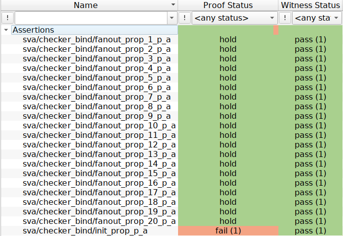
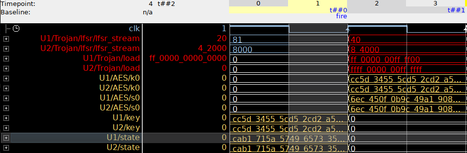

# AES-T200

The AES-T200 module was taken from the [Trust-Hub](https://trust-hub.org/#/home)[^1][^2] benchmark suite and contains a hardware trojan.

## Original Repository

https://trust-hub.org/#/benchmarks/chip-level-trojan

## Trojan Detection

We can use the UPEC tool to localize the harware trojan.
After switching to the `Trojan Detection` tab, no additional configuration is required.
The `clk` and `rst` signals are identified automatically.

After selecting `Download Trojan Detection Files`, the UPEC Tool provides the following files:

- the original RTL design
- the computational 2-instance model
- the SVA properties
- a `run_onespin.tcl` script for the [OneSpin](https://eda.sw.siemens.com/en-US/ic/questa/onespin-formal-verification/) model checker

The user initiates the process by entering the command `source run_onespin.tcl`, which loads the design, elaborates it, and runs the properties.
Out of the 21 properties that were automatically generated, exactly one property fails:

Upon examining the counterexample, it was revealed that two signals are not overwritten by a new operation. 
Therefore, these signals fail to meet the property requirement and could potentially constitute a hardware trojan.
In fact, our method **exactly pinpoints the location of the trojan**, which can be seen in the counterexample trace below:

## References

[^1]: H. Salmani, M. Tehranipoor, R. Karri: "*On Design vulnerability analysis and trust benchmark development*", IEEE Int. Conference on Computer Design (ICCD), 2013.
[^2]: B. Shakya, T. He, H. Salmani, D. Forte, S. Bhunia, M. Tehranipoor: “*Benchmarking of Hardware Trojans and Maliciously Affected Circuits*”, Journal of Hardware and Systems Security (HaSS), April 2017.
