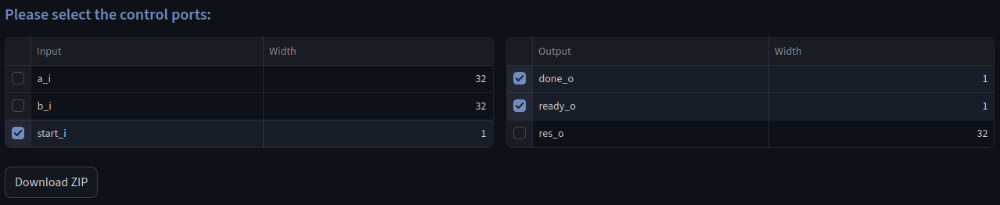
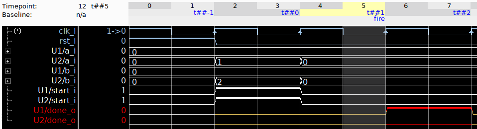
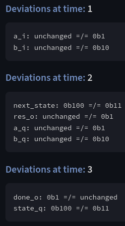

# Binary GCD module

This module implements the [Binary Euclidean Algorithm](https://en.wikipedia.org/wiki/Binary_GCD_algorithm) to compute the greatest common divisor of the two operands.

## Original Repository

https://github.com/Seek64/Binary-GCD-Verilog

## UPEC-DIT

We can use the UPEC-DIT functionality of the UPEC Tool to detect that timing of an operation depends on the operands.
As shown in the screenshot below, the user must select which inputs and outputs of the design are considered control signals.

After selecting `Download ZIP`, the UPEC Tool provides the following files:

- the original RTL design
- the computational 2-instance model
- the SVA properties `upec-dit.sv`
- Tcl scripts for the [OneSpin](https://eda.sw.siemens.com/en-US/ic/questa/onespin-formal-verification/) and [JasperGold](https://www.cadence.com/en_US/home/tools/system-design-and-verification/formal-and-static-verification.html) model checkers

The user initiates the process by entering the command `source run-onespin.tcl` or `include run-jaspergold.tcl`, respectively.
This causes the unrolled UPEC-DIT property to fail.
The corresponding counterexample shows a scenario where `a_i` or `b_i` influence the `done_o` signal.
In other words, the timing of an operation is depending on the operands.

## Counterexample Visualization

The above counterexample trace has been manually configured within the model checker to show the differences in the input and output signals.
However, the UPEC Tool also provides a functionality to automatically analyze differences in the two instances of the computational model given a trace in `.vcd` format.
In OneSpin, such a trace can be exported with

`debug -tool vcd sva/checker_bind/upec_dit_unrolled_p_a `

The user can then upload this trace in the `Counterexample` tab of the UPEC Tool to get a structured view of the information flow between the data inputs and control outputs:

