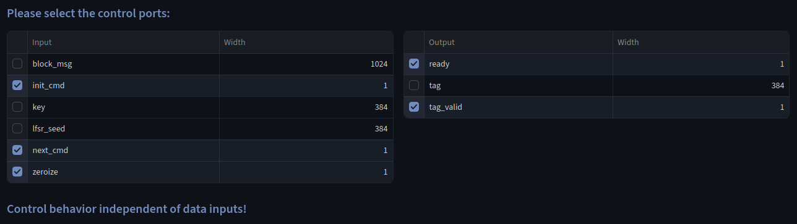
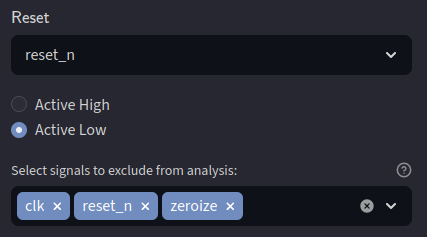
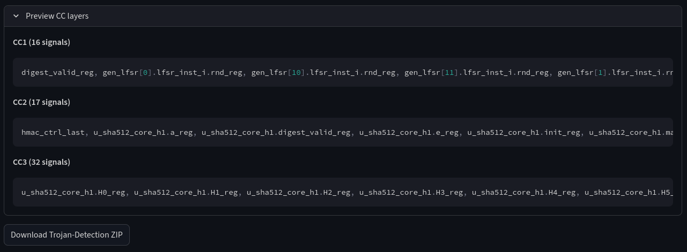

# HMAC

This accelerator implements a **H**ash-based **M**essage **A**uthentication **C**ode (HMAC) using the SHA algorithm.
The design operates data-obliviously and does not contain a hardware trojan.

## Original Repository

https://github.com/chipsalliance/caliptra-rtl/tree/main/src/hmac

## UPEC-DIT

We can use the UPEC-DIT functionality of the UPEC Tool to verify the design does not exhibit data-dependent timing.
As shown in the screenshot below, the user must select which inputs and outputs of the design are considered control signals.
In this example, the UPEC Tool determined that there is no structural connection between these signals.
Therefore, no additional formal verification is necessary.

## Trojan Detection

Since the HMAC core is a non-interfering accelerator, we can run the automatic trojan detection.
The screenshot below shows the corresponding configuration.
This design implements a `zeroize` input signal, which adds an additional flush functionality similar to `reset_n`.
Therefore, we want to exclude it from consideration.

We can now preview the precomputed input fanout ("CC layers" - see screenshot below).
For any non-interfering accelerator, any signal reachable in n clock cycles must be overwritten n cycles after a new operation starts.

By selecting `Download Trojan Detection Files`, the UPEC Tool provides the following files:

- the original RTL design
- the computational 2-instance model
- the SVA properties
- a `run_onespin.tcl` script for the [OneSpin](https://eda.sw.siemens.com/en-US/ic/questa/onespin-formal-verification/) model checker

The user can run the proof from OneSpin with `source run_onespin.tcl`.
All properties hold, meaning there is no suspicious control logic in the design that could implement a hardware trojan.