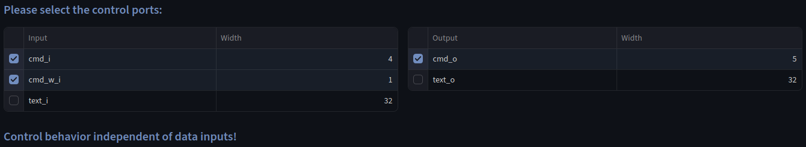

# SHA-512

Verilog Module implementing the Secure Hash Algorithm.
We verify that the design is data-oblivious using the UPEC Tool.

## Original Repository

https://opencores.org/projects/sha_core

## UPEC-DIT

We can use the UPEC-DIT functionality of the UPEC Tool to verify the design does not exhibit data-dependent timing.
As shown in the screenshot below, the user must select which inputs and outputs of the design are considered control signals.
A data-dependent side effect occurs if there is an information flow from the sensitive `text_i` data input to the `cmd_o` control output.
In this example, the UPEC Tool determined that there is no structural connection between these signals.
Therefore, no additional formal verification is necessary.

